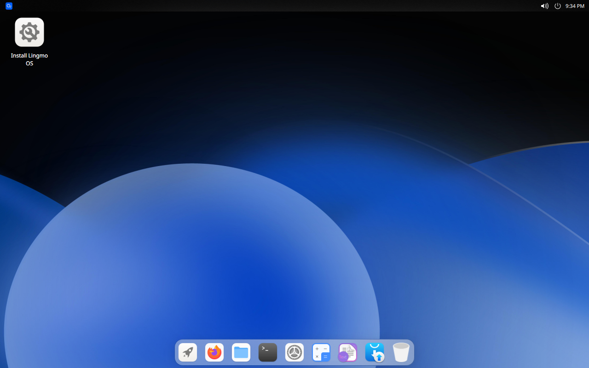

# 开始使用

## 关于 Lingmo OS
> [Lingmo OS 官方网站](https://lingmo.org/)

快速、免费且充满新功能。最新版本的 Lingmo OS 为开发人员、创作者、游戏玩家和管理员提供了新工具和增强功能。

Lingmo GNU/Linux（Lingmo OS）是一种基于 Debian GNU/Linux 的操作系统。它提供了一个美丽的桌面环境，包含为此环境量身定制的软件，并具有统一的 UI。

### 用户界面和新桌面环境
Lingmo OS 采用不同于传统 KDE 的新设计，使操作更简便。我们还优化和重构了 CutefishDE，使操作更符合用户习惯，提升用户体验。

### 轻量级和流畅的体验
Lingmo OS 可以在低性能硬件上运行，提供比 Windows 11 等重型桌面操作系统更轻便和流畅的体验。其轻量级特性确保了快速和愉快的使用体验。

### 画廊

## 安装 Lingmo OS
请参阅 [安装指南](installation-guide)。

## 在其他 Linux 发行版上安装 LingmoDE
- [Debian](faq#are-there-any-lingmode-packages-for-debian-12)
- [Arch](https://aur.archlinux.org/packages?SeB=m&K=chun-awa)

## 接下来是什么？
这里有一篇关于调整 Lingmo OS 的很棒的笔记：<https://samwhelp.github.io/note-about-lingmo/>

如果在使用 Lingmo OS 时遇到一些问题（例如硬件不兼容、bug），可以查看 [常见问题](faq) 或前往 [Lingmo OS Discussions](https://github.com/orgs/LingmoOS/discussions) 获取帮助。
