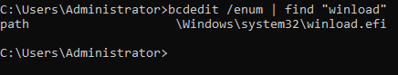
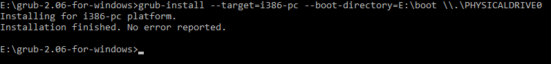

# 如何不使用CD或者USB安装Lingmo OS: 分步指南
这篇文章是不使用CD或者USB安装Lingmo OS的教程。
在安装之前，在<https://lingmo.org/index.php/download-lingmo-os>下载ISO镜像。
## *1* 准备工作
### *1.1* 检查启动模式
1. 按下`Win+R`打开运行窗口  
2. 在窗口中输入`powershell "start cmd -Verb runAs"`并按回车键打开升级的命令提示符。 
3. 输入`bcdedit /enum | find "winload"`并按回车.  
4. 如果它显示 `winload.efi`，则启动模式是UEFI.  
   
如果它显示`winload.exe`，则启动模式是BIOS.  
   
### *1.2* 创建磁盘分区
1. 按`Win+R`键启动运行对话框
2. 在“运行”对话框中键入`diskmgmt.msc`，然后按Enter键打开磁盘管理。
3 .右键单击要收缩的分区，然后选择**收缩体积**。
> 注意：如果文件系统不是NTFS，则无法缩小分区。
如果分区上有一些虚拟内存，**收缩卷**可能仍会变灰。

4. 输入要缩小的大小（至少14336MB），然后单击**缩小**。
5. 右键单击硬盘上未分配的区域，然后选择**新建简单卷**。
6. 将简单卷大小更改为4096MB，然后单击**下一步**。
7. 接受默认驱动器号，然后单击**下一步**。
8. 在**格式化分区**对话框中，将文件系统更改为FAT32。
9. 检查您的选择，然后选择**完成**。

## *2* 创建有效环境
### *2.1* 复制文件
使用[7-Zip](https://7-zip.org/)打开ISO镜像并解压所有文件和文件夹到新磁盘分区。
### *2.2* 安装GRUB2（对于UEFI）
1. 下载 [GRUB 2.06](https://ftp.gnu.org/gnu/grub/grub-2.06-for-windows.zip).  
> 提示:GRUB 2.12 不会在Windows上正确地运行。

2. 从`grub-2.06-for-windows.zip`中解压`grub-2.06-for-windows`文件夹到新磁盘分区。  
3. 像*1.1*中那样打开一个升级的命令提示符.  
4. 使用下面的命令安装GRUB2.  
> 将下命令中的 `E:` 替换为新磁盘分区 

对于UEFI：  
```cmd
cd /d E:\grub-2.06-for-windows
grub-install --target=x86_64-efi --efi-directory=E: --boot-directory=E:\boot
```
  
对于BIOS：  
```cmd
cd /d E:\grub-2.06-for-windows
grub-install --target=i386-pc --boot-directory=E:\boot \\.\PHYSICALDRIVE0
```
  
## *3* 安装Lingmo OS
### *3.1* 预安装
1. 重启电脑。  
  
2. 在登录屏幕中输入`live`，并单击**登录（Login）**按钮.  
3. 在应用列表中找到单击**安装Lingmo（Install Lingmo）**快捷方式图标 （单击程序坞上的**启动器（Launcher）** 图标展开应用列表）
### *3.2* 安装
1. 安装窗口中的前几个页面会让你选择语言，选择地区，再选择一种键盘布局。
2. 当你完成了前3步，就会进入**分区**，然后选择**手动分区**。
3. 单击空余空间，然后单击**新建**按钮。推荐EXT4文件系统。
4. 更改挂载点到 **/** 并单击**完成**。
5. 对于UEFI，单击第一个分区后单击**编辑**，让后更改挂载点到 **/boot/efi**。
6. 单击**下一步**。
7. 创建一个用户，设置一个密码和主机名（电脑的名字）。
8. 最后，它将显示你做的所有的总结概述。如果一切正常，请单击**安装**。

9. 安装过程可能需要几分钟。成功完成后，您可以将计算机重新启动到新安装的Lingmo OS。
