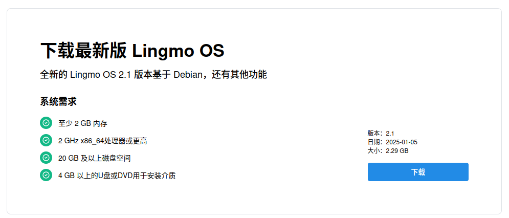
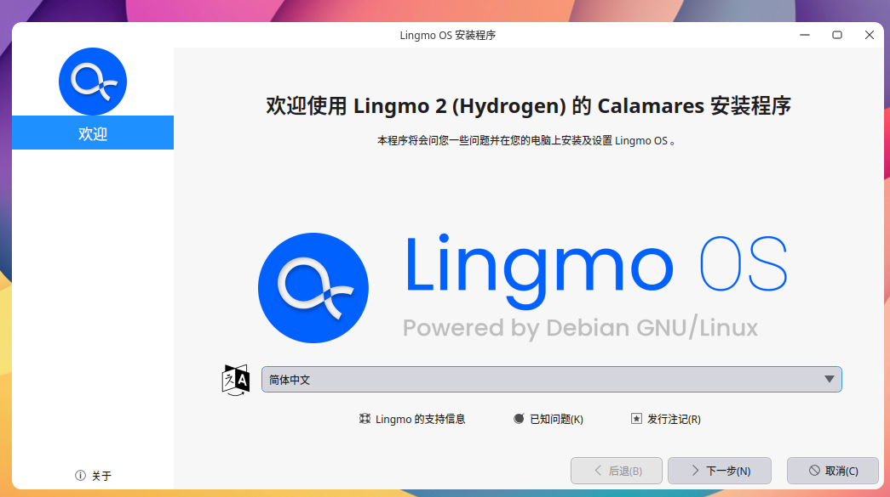
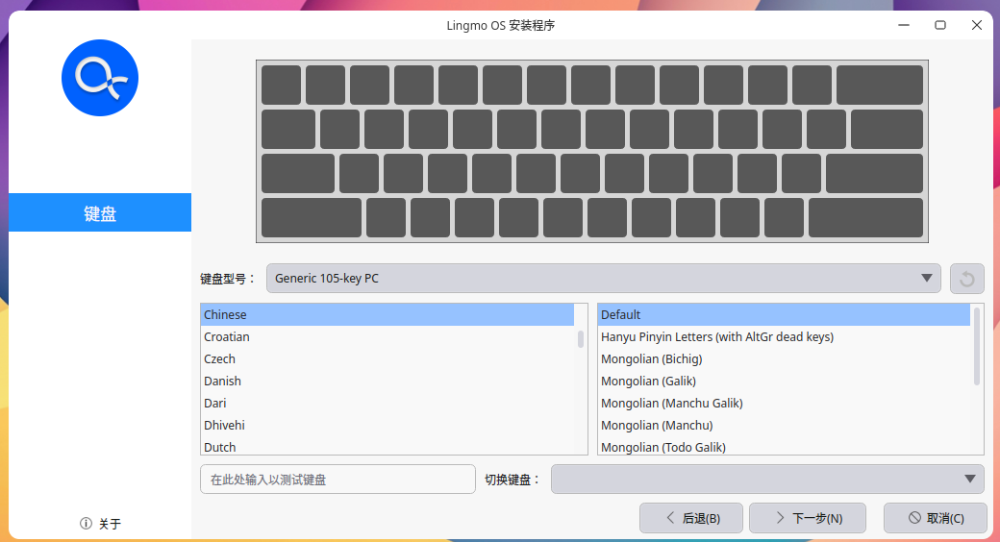
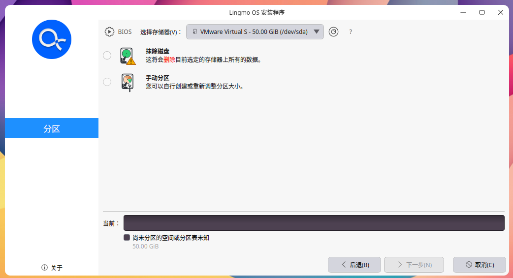
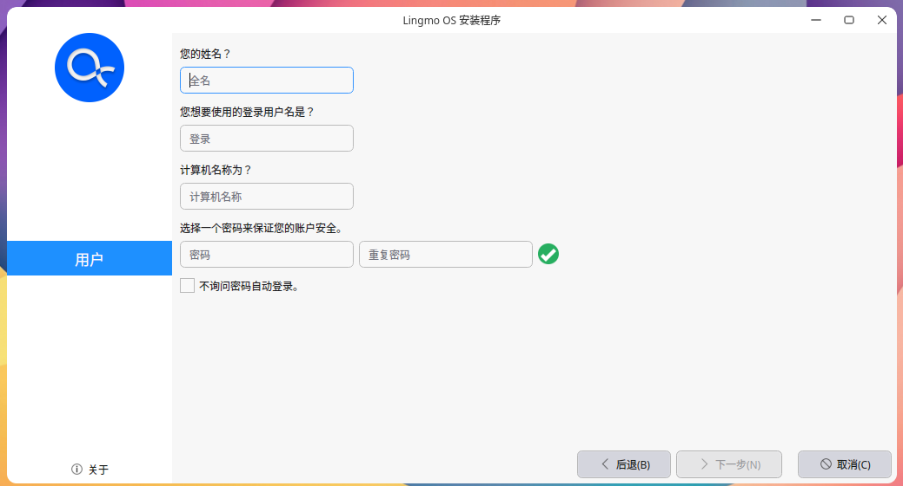
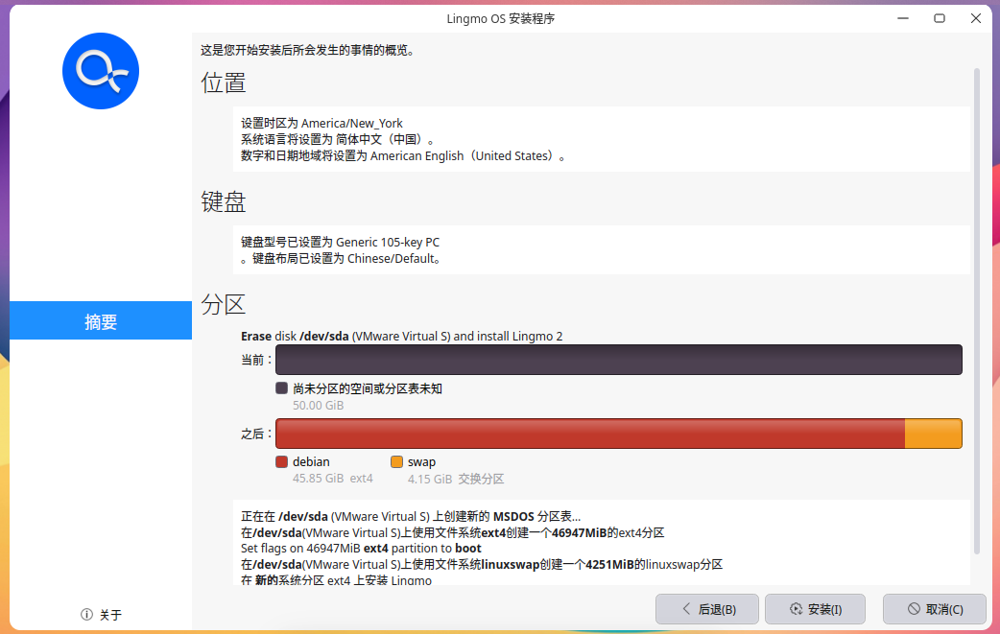
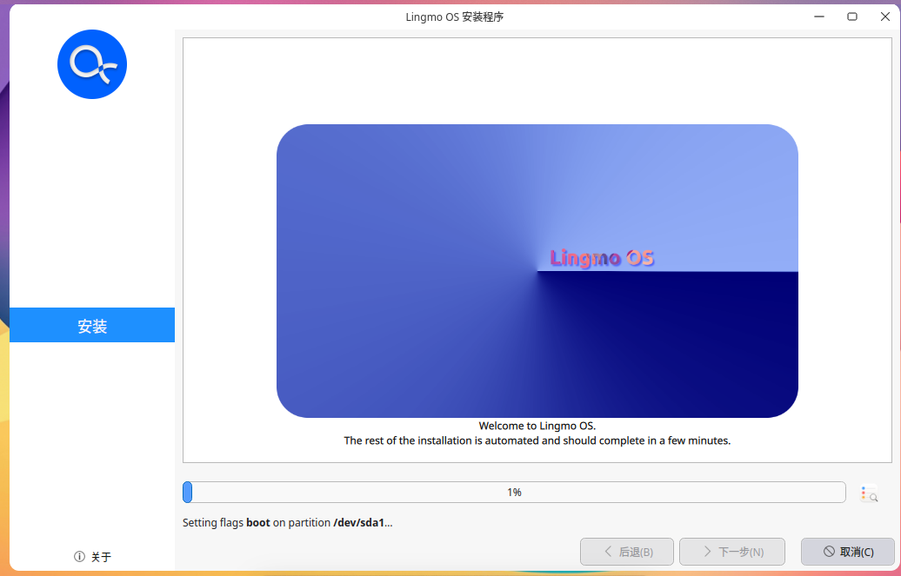
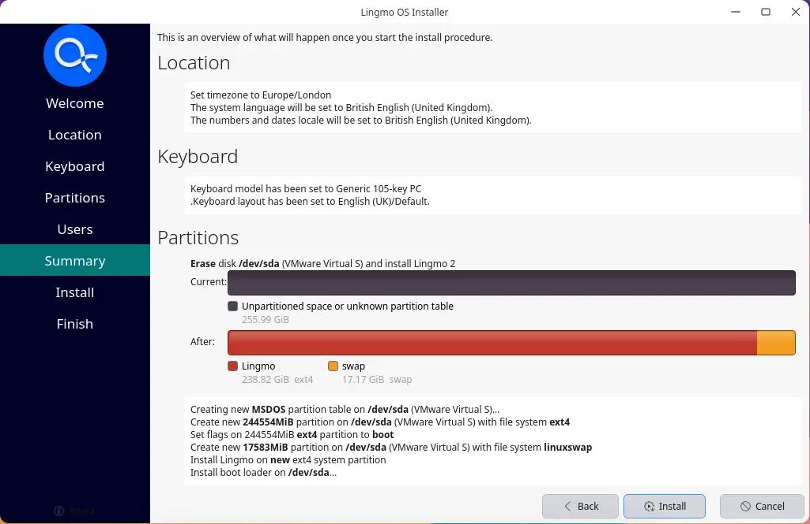

# 安装指南

> [!Warning]注意
> 请注意Lingmo OS处于**测试**版本中 - 这表示Lingmo OS正在大力开发中，因此**尚未**准备好日常使用。

在这个教程中，我们通过这些步骤会引导你安装Lingmo OS到你的电脑上。我们建议你在安装之前先阅读[FAQ](faq)。

## *1* 准备工作

- 一台有10GB空余空间的电脑

- 一个USB (建议4GB以上).

## *2* 下载一个Lingmo OS镜像

你可以在[这里](https://lingmo.org/download)下载一个Lingmo OS镜像。请确保将其保存到电脑上一个不容易忘记的位置!在本教程中，我们将使用LingmoOS 2.0测试版，该版本使用新的Lingmo安装程序，该安装程序将包含在所有未来的LingmoOS版本中。

## *3* 创建一个可启动的USB

安装LingmoOS，您需要将下载的ISO写入U盘以创建安装介质。

在本教程中，我们将使用[Ventoy](https://ventoy.net)，因为它在Linux、Windows和macOS上运行，而且非常简单，安装Ventoy后只需将ISO映像复制到U盘即可。选择与当前操作系统对应的版本，下载并安装该工具。

按照本教程将Ventoy安装到U盘并复制ISO映像：<https://ventoy.net/en/doc_start.html>

## *4* 从USB闪存盘启动

将USB闪存驱动器插入要用于安装Ubuntu的笔记本电脑或PC，然后启动或重新启动设备。它应该自动识别安装介质。如果没有，请尝试在启动时按住`F12`(根据主板制造商的说法)，然后从系统特定的启动菜单中选择USB设备。

> F12是打开系统启动菜单的最常用键，但Escape、F2和F10是常见的替代选项。如果您不确定，请在系统启动时查看一条简短的消息——这通常会通知您按哪个键打开启动菜单。

在一些较旧的图像上，您需要输入密码才能进入实时会话。如果您再次输入此项，请输入密码`live`，然后按`enter`。

登录实时系统后，您可以通过单击`安装Lingmo`来启动安装程序。

安装程序初始化后，您将被邀请选择您的语言

>您可以预览LingmoOS，而无需对PC进行任何更改。您可以通过单击桌面上的安装Lingmo快捷方式随时返回安装程序菜单。

要继续，请单击`下一步`。

##*5*选择您的位置

从地图屏幕中选择您的位置和时区，然后单击`下一步`。如果您已连接到互联网，则会自动检测此信息。

## *6* 选择键盘布局

系统将要求您选择键盘布局。选择一个后，单击`下一步`。

## *7* 选择您的分区布局

此屏幕允许您配置安装。如果您希望LingmoOS成为硬盘上唯一的操作系统，请选择`擦除磁盘`并安装LingmoOS。

如果您的设备当前安装了另一个操作系统，您将收到其他选项，可以在该操作系统旁边安装LingmoOS，而不是替换它。

### 手动安装

当使用手动设置您想要的系统时，请记住以下几点：

根目录(/)至少需要25GB的空间。

home目录(/home)需要与您的文件、音乐、图片和文档所需的空间一样多的空间。因此，最好将剩余的空间用于家庭分区，除非您要进行双启动。

建议交换至少一半可用RAM的空间。例如，对于8GB，进行至少4GB的交换。

>如果您的计算机上有Windows 8标签，您可能需要使用FAT32文件系统制作一个单独的EFI分区。

## *8* 创建您的登录详细信息

在此屏幕上，系统将提示您输入您的姓名和网络上显示的计算机名称。最后，您将创建一个用户名和一个强密码。

您可以选择自动登录或要求密码。如果您在旅行中使用设备，**不建议**启用`自动登录`。

## *9* 确认安装

现在，您将被要求查看您选择的设置。如果您对它们满意，请单击`安装`。

然后坐下来欣赏LingmoOS在后台安装时的幻灯片!🙂:

重新启动后，您可以进入新系统!

## *10* 您已经安装了LingmoOS!

感谢您完成本教程。我们希望您喜欢您的新桌面。