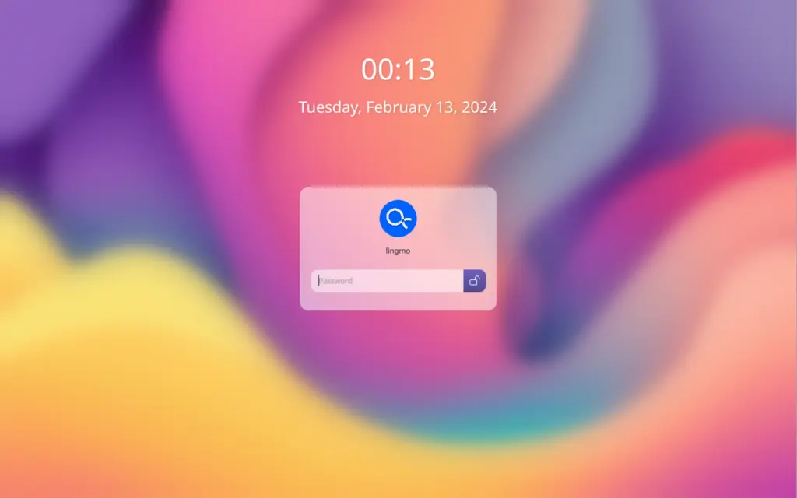
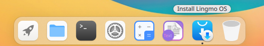

# 安装指南

> [!Warning]注意
> 请注意，Lingmo OS 尚处于**测试**版本中 - 这表明 Lingmo OS 仍在全力开发中，因此**尚未**准备好日常使用。

以下教程将通过这些步骤引导安装 Lingmo OS 到您的电脑上。我们建议您在安装之前先阅读[FAQ](faq)。

## *1* 准备工作

- 一台至少 10 GB 空余磁盘空间的电脑

- 一个 USB 设备 (建议容量为 4 GB 及以上)。

## *2* 下载 Lingmo OS 镜像

您可以在[这里](https://lingmo.org/download)下载 Lingmo OS 镜像。请确保将其保存到电脑上一个不容易忘记的位置！在本教程中，我们将使用 LingmoOS 2.1 测试版，该版本使用新的 Lingmo 安装程序，该安装程序将包含在所有未来的 LingmoOS 版本中。

## *3* 创建一个可启动的 USB 设备

安装 Lingmo OS，您需要将下载好的 ISO 镜像写入 USB 设备以创建安装介质。

在本教程中，我们将使用 [Ventoy](https://ventoy.net)，因为它可以在 Linux 和 Windows 上运行，而且非常简单。安装 Ventoy 后，只需要将 ISO 镜像文件复制到 USB 设备即可。选择与当前操作系统对应的版本，下载并安装该工具。

按照这个教程将 Ventoy 安装到 USB 设备并复制 ISO 镜像：<https://ventoy.net/en/doc_start.html>

## *4* 从 USB 设备启动

将 USB 设备插入要用于安装 Lingmo OS 的设备，然后开机或重启该设备。它应该自动识别安装介质。如果没有识别到 USB 设备，请尝试在启动时按住`F12`(因主板品牌而异)，然后从弹出的启动菜单中选择 USB 设备。

> F12 是打开系统启动菜单的最常用键，但 Escape（ESC）、F2 和 F10 是常见的替代选项。如果您不确定按哪个键，请在系统启动时查看一条简短的消息——这通常会通知您按哪个键打开启动菜单。

在一些旧版本的镜像上，您需要输入密码才能进入 Live 环境。如果遇到这种情况，请输入密码：`live` ，并按 Enter（回车）键。

登录 Live 环境后，您可以通过单击“安装 Lingmo OS”来启动安装程序。

安装程序初始化后，首先选择语言

>您可以试用 Lingmo OS 而无需对设备进行任何更改。您可以通过单击桌面上的“安装 Lingmo OS” 快捷方式随时返回安装程序菜单。

要继续安装，请单击“下一步”。

## *5* 选择您的位置

从地图屏幕中选择位置和时区，然后单击“下一步”。如果您已连接到互联网，则会自动检测此信息。

## *6* 选择键盘布局

系统将要求您选择键盘布局。选择后单击“下一步”。

## *7* 选择您的分区布局

此界面允许您配置安装。如果您希望 Lingmo OS 成为硬盘上唯一的操作系统，请选择“抹除磁盘”并安装 Lingmo OS。

如果您的设备当前已安装了其他操作系统，您将看到其他安装选项，可以在和其他操作系统并存的情况下安装 Lingmo OS，而不是覆盖原系统。

### 手动安装

当使用手动安装设置系统时，请记住以下几点：

根目录 (/)至少需要 25 GB 的空间。

Home 目录 (/home) 需要与您的文件、音乐、图片和文档所需的空间一样多的空间。因此，最好将剩余的空间用于 Home 分区，除非您需要启动双系统。

建议分出至少一半可用内存的空间用于交换空间（swap）。例如，对于 8 GB 的内存，需要分出至少 4 GB 的交换空间（swap）。

> 如果您的计算机使用 UEFI 引导，您还需要使用 FAT32 文件系统制作一个单独的 EFI 分区。

## *8* 创建您的详细登录信息

在此界面上，系统将提示您输入您的姓名和网络上显示的计算机名称。最后，您将创建一个用户名和一个强密码。

您可以选择自动登录或需要密码。如果您在旅行中使用设备，**不建议**启用`自动登录`。

## *9* 确认安装

现在，将展示出您选择的设置。如果您已经确定好了这些设置，请单击`安装`。

然后坐下来，欣赏 Lingmo OS 在后台安装时播放的幻灯片！🙂:

重新启动后，您就可以进入 Lingmo OS!

## *10* 您已经安装了 LingmoOS！

感谢您完成本教程。我们希望您喜欢这种新的界面。
